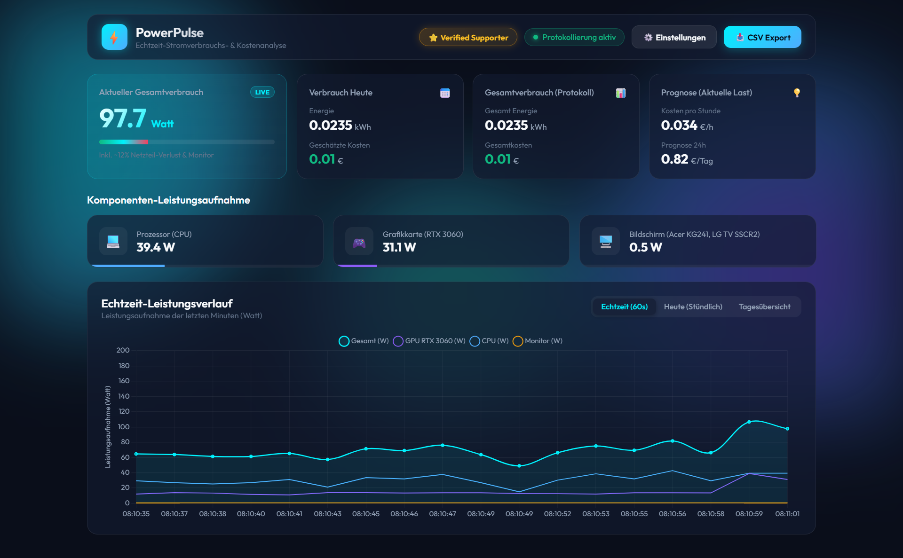

#  PowerPulse — PC & Monitor Power Consumption Tracker

**PowerPulse** is a lightweight, standalone Windows application that measures, logs, and calculates the real-time power consumption (in Watts and kWh) and electricity cost (€) of your entire PC (CPU, GPU, Motherboard/RAM) and connected Monitors.

---

## ✨ Features

- 🎮 **Real-time GPU Telemetry:** Reads exact wattage directly from NVIDIA graphics cards via `nvidia-smi` (NVML).
- 💻 **CPU & Base System Power:** Dynamically calculates CPU wattage based on live WMI load & TDP, plus Motherboard/RAM/Fan baseline.
- 🔌 **PSU Efficiency Scaling:** Accounts for power supply efficiency loss (~88% 80 Plus Gold/Platinum rating).
- 🖥️ **Smart WMI Monitor Detection:** Automatically detects connected displays (e.g., *Acer KG241*, *LG TV*) and estimates active vs. standby power draw.
- 🌐 **Multi-Language Support:** Seamlessly switch between German 🇩🇪, English 🇬🇧, Spanish 🇪🇸, French 🇫🇷, and Italian 🇮🇹.
- 🚀 **Auto-Update Notifications:** Automatically alerts you inside the app when a new release is published on GitHub.
- 💰 **Live Cost & Energy Analytics:** Calculates real-time kWh, today's cost (€), total cost, and forecasts hourly/daily electricity costs.
- 📊 **Modern Glassmorphism Dashboard:** Dark-mode responsive UI powered by Chart.js with real-time, hourly, and daily graphs.
- 📥 **SQLite History & CSV Export:** Automatically logs all readings to a local SQLite database and allows 1-click CSV exports for Excel / Data analysis.

---

## 🚀 Quick Start

1. Download the latest `PowerPulse.exe` from the [Releases](https://github.com/octavianraglean-bit/PowerPulse/releases) page.
2. Double-click `PowerPulse.exe`.
3. Your default browser will automatically open to `http://127.0.0.1:5000`.

---

## ⚙️ Customization

Inside the **⚙️ Settings** modal in the web dashboard, you can customize:
- **Electricity Price (€/kWh):** Default `0.35 €/kWh`.
- **Monitor Wattage:** Set to `auto` for automatic WMI multi-monitor detection, or set a custom fixed wattage.
- **CPU TDP Rating:** Default `95 W`.
- **PSU Efficiency:** Default `88%`.
- **Donation Link:** Customize your personal Ko-fi or PayPal link.

---

## 💖 Support the Developer

If PowerPulse helps you track your energy consumption or save money on electricity bills, please consider supporting my work!

*All donations directly support my medical treatment, therapy, and diagnostic expenses for chronic illness while helping me build more free open-source software.*

---

## 📄 License

Distributed under the [MIT License](LICENSE).
